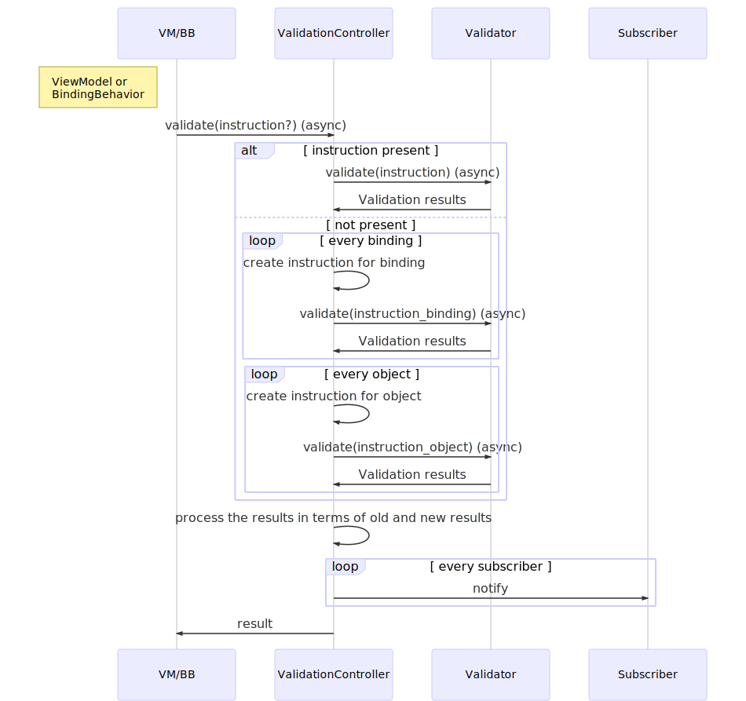

# Validating Data

This documentation explains how to validate the user input for your app using the validation plugin.
The plugin gives you enough flexibility to write your own rules rather than being tied to any external validation library.


**Here's what you'll learn...**

* How to register and customize the plugin
* How to define the validation rules
* How to validate the data
* How to apply model-based validation rules


> Note If you have already used the `aurelia-validation` plugin previously and are migrating your existing Aurelia app to Aurelia vNext then [jump straight to the migration guide](validating-data.md#migration-guide-and-breaking-changes).

## Getting started

* Install the plugin using:

  ```bash
  npm i @aurelia/validation
  ```

* Register the plugin in your app with:

  ```typescript
  import { ValidationConfiguration } from '@aurelia/validation';
  import Aurelia from 'aurelia';

  Aurelia
    .register(ValidationConfiguration)
    .app(component)
    .start();
  ```

* Inject the infra to your view-model and define rules, and use `validate` binding behavior in your markup.

  
  

  ```typescript
  import { IValidationController, IValidationRules } from '@aurelia/validation';

  export class AwesomeComponent {
    private person: Person; // Let's assume that we want to validate instance of Person class
    public constructor(
      @newInstanceForScope(IValidationController) private validationController: IValidationController,
      @IValidationRules validationRules: IValidationRules
    ) {
      this.person = new Person();

      validationRules
        .on(this.person)
        .ensure('name')
          .required()
        .ensure('age')
          .required()
          .min(42);
    }

    public async submit() {
      const result = await this.validationController.validate();
      if(result.valid) {
        // Yay!! make that fetch now
      }
    }
  }
  ```

  

  

  ```html
  <form submit.delegate="submit()">
    <input value.bind="person.name & validate">
    <input value.bind="person.age & validate">
  </form>
  ```

  
  

  > `@newInstanceForScope(IValidationController)` injects a new instance of validation controller which is made available to the children of `awesome-component`. More on validation controller [later](TODO).

That's all you need to do to get started with the plugin.
However, read on to understand how the plugin functions, and offers flexible API to support your app.

## How does it work

This section gives a simplified overview of how this plugin works, so that you can use the plugin with more confidence.

* The validationRules (`IValidationRules` instance) allows defining validation rules on a class or object/instance. The defined rules are stored as metadata in a global registry.
  
* The instance of `PropertyRule` instance hold the collection of rules defined for a property. In simplified terms it can be described by the diagram below.
  
* The validator (`IValidator` instance) allows you to execute a validate instruction, which instructs which object and property needs to be validated (more details on the validation instruction discussed [later](TODO)). The validator gets the matching rules from the RulesRegistry (see the diagram above), and executes those.
  
* The last piece of the puzzle is to getting the rules executed on demand. For this the validation controller (`IValidationController` instance) is used along with the `validate` binding behavior (more on these later). The binding behavior registers the property binding with the validation controller, and on configured event, instructs the controller to validate the binding. The validation controller eventually ends up invoking the `IValidator#validate` with certain instruction which triggers the workflow shown in the last diagram. The following diagram shows a simplified version of this.
  

The following sections describe the API in more detail, which will help understanding the concepts further.

## Registering the plugin

The plugin can be registered as follows.

```typescript
import { ValidationConfiguration } from '@aurelia/validation';
import Aurelia from 'aurelia';

Aurelia
  .register(ValidationConfiguration)
  .app(component)
  .start();
```

This sets up the plugin with the required dependency registrations.
The registration can be customized as well as shown below.

```typescript
import { ValidationConfiguration } from '@aurelia/validation';
import Aurelia from 'aurelia';

Aurelia
  .register(ValidationConfiguration.customize((options) => {
    // customization callback
    options.DefaultTrigger = customDefaultTrigger;
  }))
  .app(component)
  .start();
```

Following options are available for customizations.

* `ValidatorType`: Custom implementation of `IValidator`. Defaults to `StandardValidator`.
* `MessageProviderType`: Custom implementation of `IValidationMessageProvider`. Defaults to `ValidationMessageProvider`.
* `ValidationControllerFactoryType`: Custom implementation of factory for `IValidationController`; Defaults to `ValidationControllerFactory`.
* `CustomMessages`: Custom validation messages.
* `DefaultTrigger`: Default validation trigger. Defaults to `blur`.
* `HydratorType`: Custom implementation of `IValidationHydrator`. Defaults to `ModelValidationHydrator`.
* `UseSubscriberCustomAttribute`: Use the `validation-errors` custom attribute. Defaults to `true`.
* `UseSubscriberCustomElement`: Use the `validation-container` custom element. Defaults to `true`.

These options are explained in details in the respective sections.

## Defining rules

Let us also consider the following `Person` class, and we want to define validation rules for this class or instance of this class.

```typescript
export interface Address {
  line1: string;
  line2?: string;
  city: string;
  pin: number;
}

export class Person {
  public constructor(
    public name: string,
    public age: number,
    public email: string,
    public pets: string[],
    public address?: Address,
  ) { }
}
```

To define rules use the `IValidationRules` fluent API.
In order to do that you need to use the `@IValidationRules` constructor parameter decorator which will inject an transient instance of `IValidationRules` object.
This is shown in the following example.




```typescript
import { IValidationController, IValidationRules } from '@aurelia/validation';

export class AwesomeComponent {
  public constructor(
    @IValidationRules validationRules: IValidationRules
  ) { }
}
```




The fluent API syntax has following parts.

1. Start applying ruleset on a target using `.on`. The target can be an object instance or class.
2. Select a property from the target using `.ensure`.
3. Associate rules with the property using `.required`, `.matches` etc.
4. Customize the property rules using `.wthMessage`, `.when` etc.

### Specify validation target using `.on`

Be it is an object instance or class, both can be used as validation target using `.on`.




```typescript
const person: Person = new Person(...);
validationRules
  .on(person);
```




```typescript
validationRules
  .on(Person);
```




Specifying the target serves two purposes.
Firstly, this initiates an empty collection of rules (ruleset) for the target.
Secondly, this helps providing the typing information from the target to the subsequent methods which in turn provides with intellisense for the property names (see next section).

### Specifying target property for validation using `.ensure`

The `.ensure` method can be use used select a property of the target for validation.
This adds an instance of `PropertyRule` to the ruleset for the object.
The property can be defined using a string or a lambda expression.

```typescript
validationRules
  .on(person)
  .ensure('name')                   // string literal
  //...
  .ensure((p) => p.age)             // lambda expression
  //...
  .ensure("address.line1")          // nested property using string literal
  //...
  .ensure((p) => address.line2)     // nested property using lambda
  //...
```

With TypeScript support, intellisense is available for both the variants.

### Associating validation rules with property

After selecting a property with `.ensure` the next step is to associate rules.
The rules can be built-in or custom.
Irrespective of what kind of rule it is, at the low-level it is nothing but an instance of the rule class.
For example, the "required" validation is implemented by the `RequiredRule` class.
This will be more clear when you will define custom validation rules.
However, let us take a look at the built-in rules first.

**`required`**

Considers the property to be valid if the value is not `null`, and not `undefined`.
In case of string, it must not be empty.

```typescript
validationRules
  .on(person)
  .ensure('name')
  .required();
```

This instantiates a `RequiredRule` for the property.

> Note that this is the only built-in rule that considers `null`, `undefined`, or empty string as invalid value. The other built-in rules purposefully consider `null`, `undefined`, or empty string as valid value. This is done to ensure single responsibility for the built-in rules.

**`matches`**

Considers the string property to be valid if the value matches the given pattern described by a regular expression.

```typescript
validationRules
  .on(person)
  .ensure('name')
  .matches(/foo/); // name is valid if it contains the string 'foo'
```

This instantiates a `RegexRule` for the property.

**`email`**

This also instantiates a `RegexRule` for the property, but with a specific regex for matching emails.

```typescript
validationRules
  .on(person)
  .ensure('email')
  .email();     // person's email need to be valid
```

**`minLength`**

Considers the string property to be valid if the value is at least of the specified length.
Under the hood, it instantiates a `LengthRule` with minimum length constraint.

```typescript
validationRules
  .on(person)
  .ensure('name')
  .minLength(42);     // name must be at least 42 characters long
```

**`maxLength`**

Considers the string property to be valid if the value is at most of the specified length.
Under the hood, it instantiates a `LengthRule` with maximum length constraint.

```typescript
validationRules
  .on(person)
  .ensure('name')
  .maxLength(42);     // name must be at most 42 characters long
```

**`minItems`**

Considers the collection (array) property to be valid if the array has at least the number of items specified by the constraint.
Under the hood, it instantiates a `SizeRule` with minimum size constraint.

```typescript
validationRules
  .on(person)
  .ensure('pets')
  .minItems(42);    // a person should have at least 42 pets
```

**`maxItems`**

Considers the collection (array) property to be valid if the array has at most the number of items specified by the constraint.
Under the hood, it instantiates a `SizeRule` with maximum size constraint.

```typescript
validationRules
  .on(person)
  .ensure('pets')
  .maxItems(42);    // a person should have at most 42 pets
```

**`min`**

Considers the numeric property to be valid if the value is greater than or equal to the given lower bound.
Under the hood, it instantiates a `RangeRule` with `[min,]` interval (if your unfamiliar with the interval notation, you can refer [this](https://en.wikipedia.org/wiki/Interval_(mathematics)#Classification_of_intervals).

```typescript
validationRules
  .on(person)
  .ensure('age')
  .min(42);     // a person should be at least 42 years old
```

**`max`**

Considers the numeric property to be valid if the value is less than or equal to the given upper bound.
Under the hood, it instantiates a `RangeRule` with `[,max]` interval (if your unfamiliar with the interval notation, you can refer [this](https://en.wikipedia.org/wiki/Interval_(mathematics)#Classification_of_intervals).

```typescript
validationRules
  .on(person)
  .ensure('age')
  .max(42);     // a person should be at most 42 years old
```

**`range`**

Considers the numeric property to be valid if the value is greater than or equal to the given lower bound and less than or equal to the given upper bound.
Under the hood, it instantiates a `RangeRule` with `[min,max]` interval (if your unfamiliar with the interval notation, you can refer [this](https://en.wikipedia.org/wiki/Interval_(mathematics)#Classification_of_intervals).

```typescript
validationRules
  .on(person)
  .ensure('age')
  .range(42, 84);     // a person's age should be between 42 and 84 or equal to these values
```

**`between`**

Considers the numeric property to be valid if the value is strictly greater than the given lower bound and strictly less than the given upper bound.
If the value matches any of the boundary value, it is considered invalid.
Under the hood, it instantiates a `RangeRule` with `(min,max)` interval (if your unfamiliar with the interval notation, you can refer [this](https://en.wikipedia.org/wiki/Interval_(mathematics)#Classification_of_intervals).

```typescript
validationRules
  .on(person)
  .ensure('age')
  .between(42, 84);     // a person's age should be between 42 and 84, but cannot be equal to any these values
```

**`between`**

Considers the property to be valid if the value is strictly equal to the expected value.
Under the hood, it instantiates a `EqualsRule`.

```typescript
validationRules
  .on(person)
  .ensure('name')
  .equals('John Doe');  // Only people named 'John Doe' are valid
```

* Define custom rules
  * `satisfies`
  * `satisfiesRule`
  * Instantiating the build rules the same way

* Defining rules on multiple objects.

```typescript
validationRules
  .on(person1)
  .ensure('name')
  .required()

  .on(person2)
  .ensure('age')
  .required()
```

### Customizing rules

* with message
* with display name
* conditional
* sequencing

## Tagging rules

## Migration Guide and Breaking Changes
* Transient `IValidationRules`
* `.on` is the starting point
